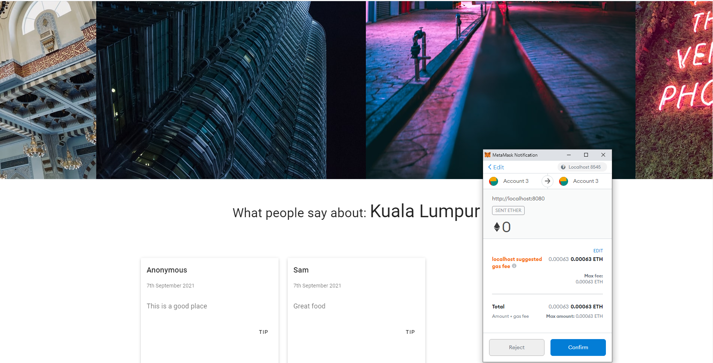

# Delp

## Decentralized application in Solidity and Vue

### 1. Set up local blockchain, or ganache in this case

Install and set up truffle and ganache, refer [official website](https://www.trufflesuite.com/ganache)

### 2. in root folder, `truffle compile`, then `truffle migrate`

Deploy Solidity smart contracts

### 3. `docker pull redis`, then `docker run -d -p 6379:6379 redis`

Pull latest redis image and run on local machine

### 4. In delp-api, `node import.js`, then `nodemon index.js`

Import the countries and cities and then run the server

### 5. In delp-ui, `npm run serve`

Start the frontend
